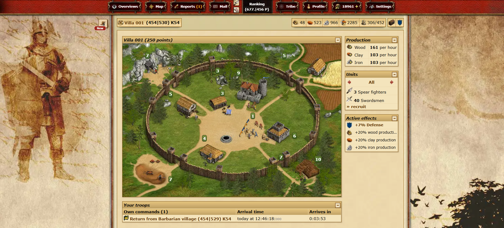
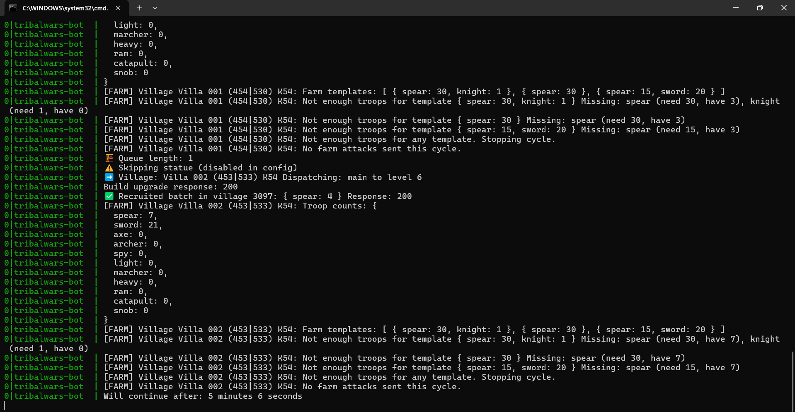

# Tribal Wars Bot (Node.js)

A fully automated bot for the browser game [Tribal Wars](https://www.tribalwars.net/), built in Node.js. This project demonstrates advanced web automation, scraping, and game strategy logic, making it a great showcase for software engineering, automation, and reverse engineering skills.

## Screenshots

### Tribal Wars Game


### Bot Running in Terminal


## Features

- **Automated Building Upgrades:** Follows a configurable build plan to upgrade village buildings efficiently, checking for resources and queue limits.
- **Troop Recruitment:** Automatically recruits troops based on customizable templates and current village status.
- **Farming Automation:** Finds the nearest barbarian villages and sends attacks using predefined troop templates to maximize resource gain.
- **Multi-Village Support:** Manages multiple villages by reading their data and applying the same automation logic.
- **Captcha Detection:** Stops operation if bot protection (captcha) is detected to avoid bans.
- **Configurable:** Uses JSON files for configuration, build plans, and troop templates, making it easy to adapt to different accounts or strategies.
- **Cookie Management:** Handles authentication via cookies for seamless session management.

## Tech Stack

- Node.js (ES modules)
- Axios (HTTP requests)
- Cheerio (HTML parsing)
- Tough-cookie (cookie management)
- PM2 (process management, via ecosystem.config.cjs)

## How It Works

- Reads configuration and session cookies from `data/bot_config.json`.
- Loads village and map data, then cycles through each village to:
  1. Upgrade buildings if resources and queue slots are available.
  2. Recruit troops according to the current stage and available resources.
  3. Send farming attacks to nearby barbarian villages.
- Loops with random delays to mimic human behavior.

## Getting Started

1. **Clone the repository and install dependencies:**
   ```bash
   git clone https://github.com/yourusername/tw-bot-nodejs.git
   cd tw-bot-nodejs
   npm install
   ```
2. **Set up your configuration:**
   - Edit `data/bot_config.json` with your Tribal Wars server URL and session cookies.
   - Configure your build and troop templates in the `templates/` and `data/` folders.
3. **Run the bot:**
   ```bash
   node index.js
   ```
   Or use PM2 for process management:
   ```bash
   pm2 start ecosystem.config.cjs
   ```

## Disclaimer

This bot is for educational purposes only. Using automation in Tribal Wars may violate the game's terms of service and can result in bans. Use at your own risk.

---

**Author:** Debarshi

If you are a recruiter or employer, this project demonstrates my skills in Node.js, automation, web scraping, and reverse engineering complex browser-based applications. Please feel free to reach out for collaboration or job opportunities!
